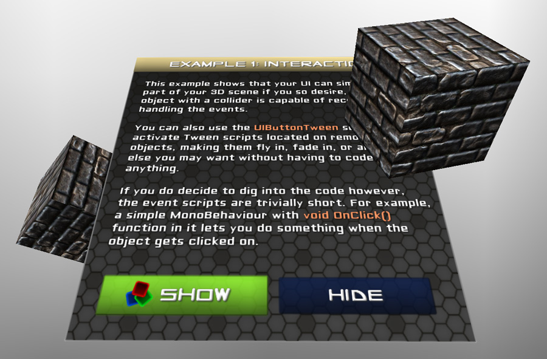

================
2.Interaction
================

.. This example shows that your UI can easily be a part of your 3D scene. Since NGUI simply generates meshes for you, you can position them in your scene freely.
このExmapleは3DシーンのUIを簡単にしてくれるのを示します。NGUIは簡単にメッシュを生成してくれるので、シーン上に自由に配置できます。

.. You can create signs, interactable in-game HUD windows, dynamic effects such as Scrolling Combat Text from World of Warcraft, and just about anything else you can think of.
HUDウィンドウベースのゲームでインタラクティブ、このようなWorld of WarcraftのからScrolling Combat Text [#f1]_ などの動的な効果を、考えられるものは何でも作成することができます。

.. When it comes to interaction, you will find NGUI’s event system to be extremely flexible, with only two conditions:
それは相互作用に来るとき、NGUIのイベントシステムはたった2つだけの条件で、非常に柔軟であることがわかります。

.. The camera that sees your object must have a UICamera script attached.
1. このカメラは **UICamera** スクリプトがアタッチされているオブジェクトだけ見ることが出来ます。

..  The object that wants to receive an event must have a collider. No need for it to be a widget. Any in-game object will work.
2. このオブジェクトがコライダーを持っている必要があります。ウィジェットである必要はありません。どんなゲーム内のオブジェクトでも動作します。

.. image:: ../images/interaction.jpeg

.. There are a variety of scripts under the Component/NGUI/Interaction menu that you can use:
使用可能な **Component/NGUI/Interaction** のメニューに様々なスクリプトがあります：

.. For example in order to create an object that changes color on touch or mouse over, you can simply attach UIButtonColor script to its collider and specify what object it should be working with. It doesn’t need to be a widget either — if you specify an object with a renderer or a light as its target, and it will also work just fine.
例えばタッチやマウスオーバーで色を変更するオブジェクトを作成するためには、単にそのコライダーに **UIButtonColor** スクリプトをアタッチし、それが作業すべきであろうオブジェクトを指定することができます。これはウィジェットである必要もありません—レンダラや、そのターゲットとしてライトを持つオブジェクトを指定した場合も、うまく動作するでしょう。

.. Want the object to grow slightly? UIButtonScale. Move? UIButtonOffset. You can activate remote disabled Tween components by using UIButtonTween. You can even make it possible to drag an object around by attaching UIDragObject script to the collider and specifying what it should be dragging. You can look at Example 7 to see how this script was used to make an interactable scroll list.
オブジェクトを少しばかりグローしたいですか？ **UIButtonScale** です。動かしますか？ **UIButtonOffset** です。 **UIButtonTween** を使用して、リモートの ``disabled`` の ``Tween`` コンポーネントをアクティブにすることができます。それが可能なコライダーに **UIDragObject** スクリプトをアタッチし、それをドラッグすべきかを指定することによって、周りのオブジェクトをドラッグすることさえもできます。このスクリプトはインタラクティブ可能なスクロールリストを作成するために使用された方法をExample 7で確認できます。

.. But in this example we stick to the basics: the buttons trigger a remote tween animation on the cubes and the window, making its position change.
しかし、このExampleでは、基本線でいきます：このボタンは、その位置変更を行う、キューブとウィンドウ上のリモートのトゥイーンアニメーションをトリガします。

.. When it comes to creating your custom event scripts, NGUI makes it as simple as possible. Simply create a MonoBehaviour that implements one of the functions mentioned on the Event page, and attach it to the collider of your own choice.
それは、カスタムイベントスクリプトを作成時に、NGUIは出来るだけシンプルにしてくれます。単にイベントのページに記載のいずれかの関数を実装し ``MonoBehaviour`` を作成し、選択する自身のコライダーを取り付けます。

.. For example the following script will print “Hello World!” to the debugger when you click on a collider that has it attached.
例えば、それがアタッチされているコライダーをクリックしたとき、次のスクリプトはデバッガへ "Hello World！"と表示します。

.. code-block:: python
   :linenos:
   using UnityEngine;
   
   public class ClickEventReciever : MonoBehaviour
   {
       void OnClick ()
       {
           Debug.Log("Hello World");
       }
   }

.. rubric::

.. [#f1] 【訳注】通称SCTのアドオン。自キャラの頭の上にダメージやHealで回復した量、敵から受けたDebuff（弱体魔法）、Parry、Dodge、Blockの発動など自分が受けた効果をすべて画面に表示してくれ、戦闘画面が適度に賑やかになって、なおかつ自分の受けた効果が分かりやすくなる。
