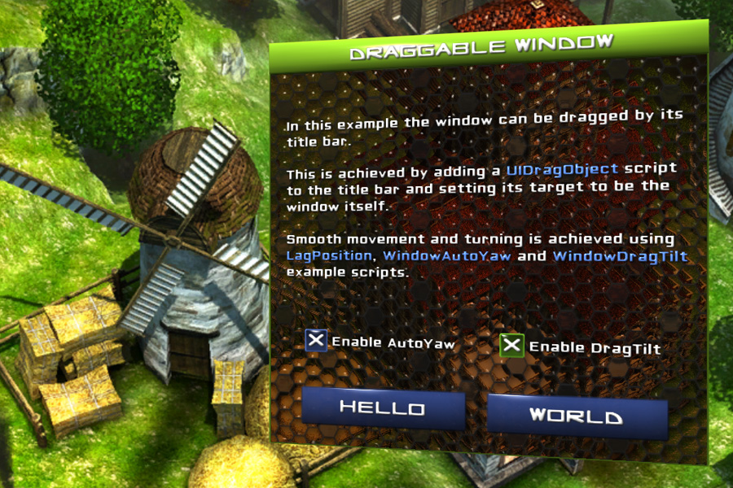

====================
6.Draggable Window
====================

.. In this example the window from Example 5 is given an additional feature: the ability to be dragged.
このExmapleでは、Exmaple 5からのウィンドウが追加機能を加えられています：ドラッグされるようにです。

.. Letting something be draggable is trivial with NGUI — simply add UIDragObject to the collider you want to receive the drag events (for example the object itself), and set its target to the object you wish to drag (for example this same object). The script will do the rest.
NGUIを用いて何かをドラッグ可能にさせることは簡単です - 単にドラッグイベント（例えば、オブジェクト自体）を受信したいコライダーに **UIDragObject** を追加し、ドラッグしたいオブジェクト（例えば、これと同じオブジェクト）にそのターゲットを設定します。このスクリプトは残り部分を行います。

.. In order to make the example more interesting, several other scripts are used:
このExampleでは、より面白くするために他にもいくつかスクリプトが使用されています：

.. LagPosition is used to make the window move smoother than it normally would be, as mouse updates happen less frequently than frame updates.
1. **LagPosition** は、マウスのアップデートがフレームの更新よりも低い頻度で発生するように、それは通常よりもスムーズにウィンドウの移動をするために使用されます。

.. WindowAutoYaw and WindowDragTilt are short (~30-lines) custom scripts written specifically for this example that turn the window as it gets farther away from the center, and tilt it sideways as it’s dragged, respectively.
2. **WindowAutoYaw** と **WindowDragTilt** は中心から離れるにつれてウィンドウをオンにし、それはそれぞれ、ドラッグしているとして、横に傾け、このExampleでは具体的に書かれた短い（〜30行）カスタムスクリプトです。

.. A pair of checkboxes have been added to the window that have UIActivatedComponent scripts on them that are used to enable and disable the 3 scripts mentioned above. More on checkboxes can be found in Tutorial 11.
チェックボックスのペアは、上記の3つのスクリプトを有効および無効にするために使用されるそれらに **UIActivatedComponent** スクリプトを持っているウィンドウに追加されました。チェックボックスについての詳細については、Tutorial 11を御覧ください。

